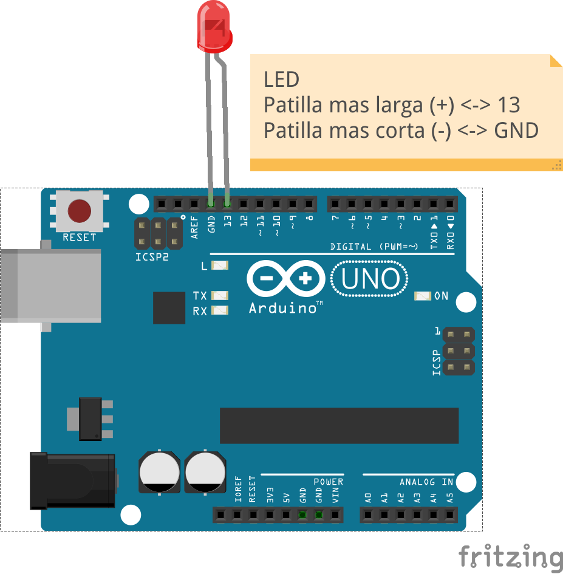
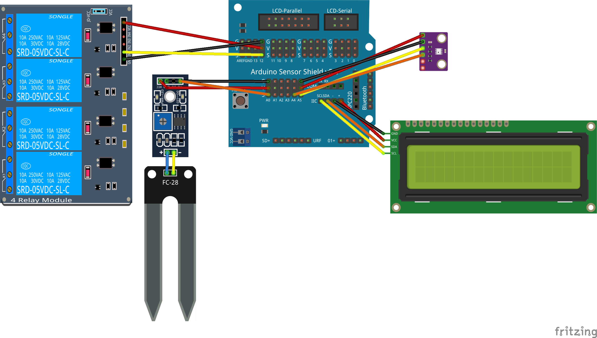
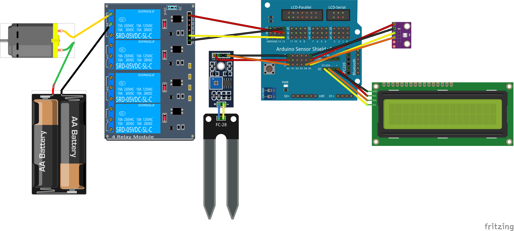

# SmartCities_Domotica

## Información y control del hogar

Trabajaremos en implementar una casa domótica conectada con los siguientes elementos
  * Medida de la temperatura y humedad interna
  * Control y regulación de temperatura y humedad
  * Control de riego
  * Control de iluminación

Toda la información así como el control está disponible desde Internet

### Materiales
* Controlador
* Sensores (cualquiera entre:luz,temperatura, humedad,...)
* Wifi
* Placa de reles
* Alimentación
* Cables

## Montaje

## https://goo.gl/Yf3hrm

## Hello Led y PC

Conectamos un led a la patilla 13 y lo encendemos y apagamos, es el "Hola Mundo" de Arduino!! Podemos ver los desde el monitor serie: Menu Herramientas/Monitor Serie

Detalles:
* Pines de Arduino
* Polaridad LED
* Necesidad de resistencia

Sobre Arduino:
* Una vez programado, se puede desconectar y el programa se guarda.
* Al alimentarlo se ejecuta el último programa que se envió
* Sólo puede tener un programa, cuando se reprograma se pierde el anterior

### Ejemplo: Domotica/1.LED_Conexion_PC

## LCD

Conectamos una pantalla LCD y aprendemos a mostrar contenidos

Detalles:
* Pines Shield
* I2C
* Cada fabricante usa una dirección para su LCD.
* Podemos usar las direcciones:
    * 0x27
    * 0x3F

### Ejemplo: Domotica/2.LCD

## [Otros sensores](https://github.com/javacasm/SmartCities_Comunes/blob/master/Componentes.md)

## Sensor BME280

Usamos el sensor atmosférico BME280 para medir temperatura, presión y humedad ambiente

### Ejemplo: Domotica/3_Meteo_BME280

## Wifi

Antes de continuar tenemos que aprender a utilizar el Wifi de Arduino

[Configuración Wifi](./wifi.md)

Servidor Web
Control remoto

#### http://192.168.1.<ID>/arduino/webserver

### Ejemplo: Domotica/4_Meteo_Wifi

## Sensor de humedad

### Ejemplo: Domotica/5_Sensor_Humedad

## Relés de riego
Explicación sobre los relés

## Conexión de Bomba

## Relés para simulación de Aire acondicionado/Calefación
  Configuración de temperatura

## Iluminación automática
  Medida de luminosidad
  Conexión de iluminación (simulación con un led)
