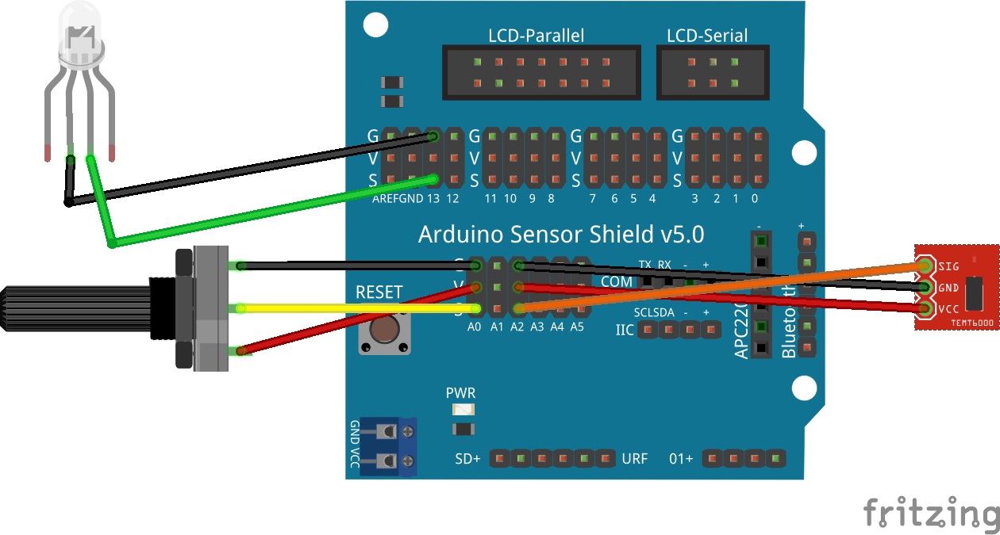
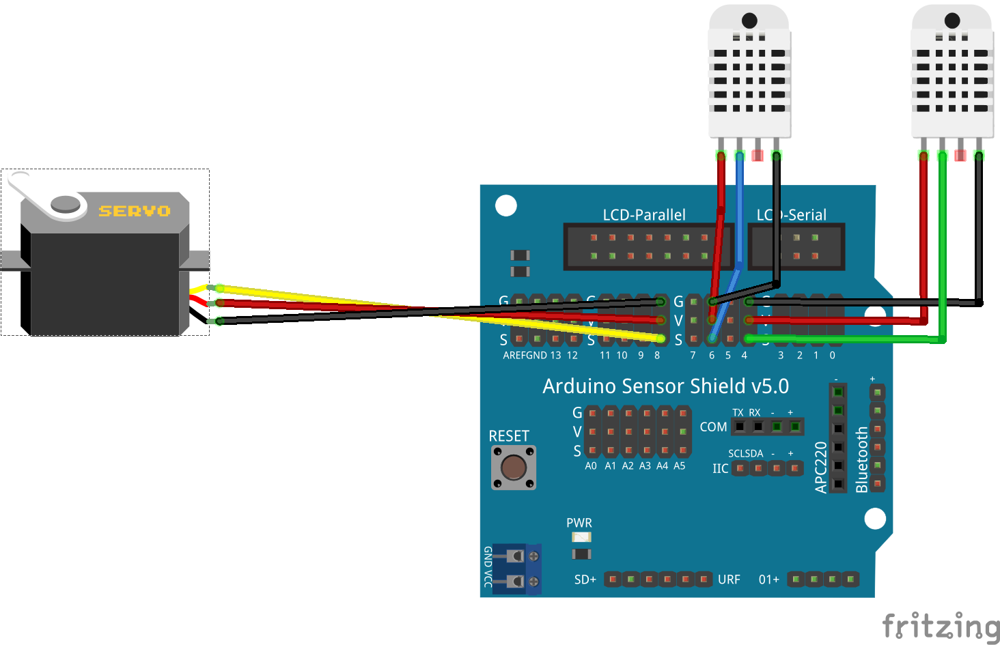
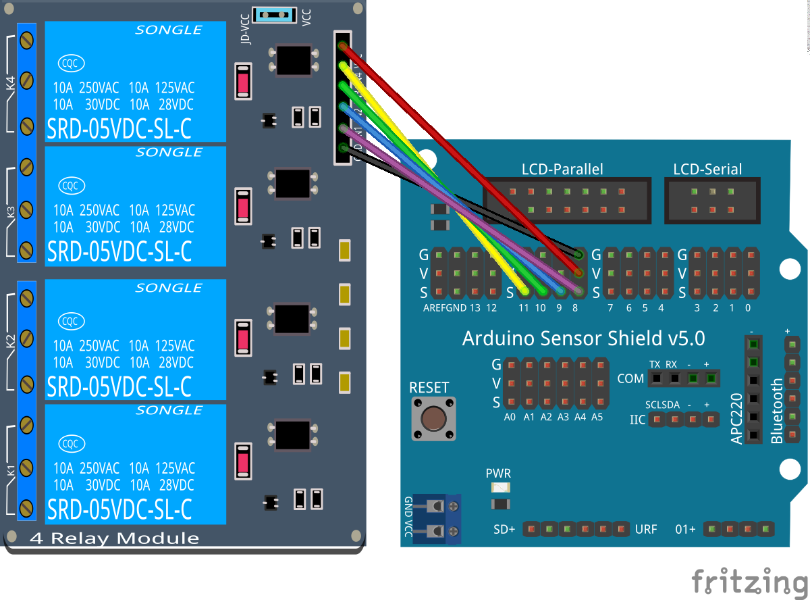

# SmartCities_Domotica

## Información y control del hogar

Trabajaremos en implementar una casa domótica conectada con los siguientes elementos
  * Control y regulación de temperatura y humedad
  * Control de iluminación
  * Control de puerta de garaje

Toda la información así como el control está disponible desde Internet

## Maqueta: Casa domótica
* Control y regulación de temperatura
* Control de puerta de garaje

### Materiales
* Controlador
* Sensores (cualquiera entre:luz,temperatura, humedad,...)
* Wifi
* Placa de reles
* Alimentación
* Cables

### Ejemplos

#### Control de iluminación

Utilizamos un sensor de luz para activar automáticamente la iluminación

### Medida de 2 temperaturas

Utilizamos dos sensores de temperatura DHT22 para medir la temperatura en el exterior y el interior de la casa

#### Comparando temperaturas

Utilizamos dos sensores de temperatura DHT22 y mostramos los datos en la consola

Ejemplo: SmartCities/Domotica/Comparando_temperaturas

### Control de Ventilación

Controlamos la apertura de una rejilla mediante un motor de tipo servo en función de la diferencia entre la temperatura interior y exterior

### Control remoto de reles

Podemos utilizar relés para controlar cualquier dispositivo eléctrico

Ejemplo: SmartCities/Domotica/Control_remoto

### Ampliación: iluminación

Uso de Mosfet

#### Materiales

* Placa Mosfet
* Tira de Leds
* Alimentación para los leds

## Referencias

[Alarma por MQTT](https://medium.com/@leeuwte/stable-esp01-motion-sensor-for-mqtt-2d81c0b1e317)
