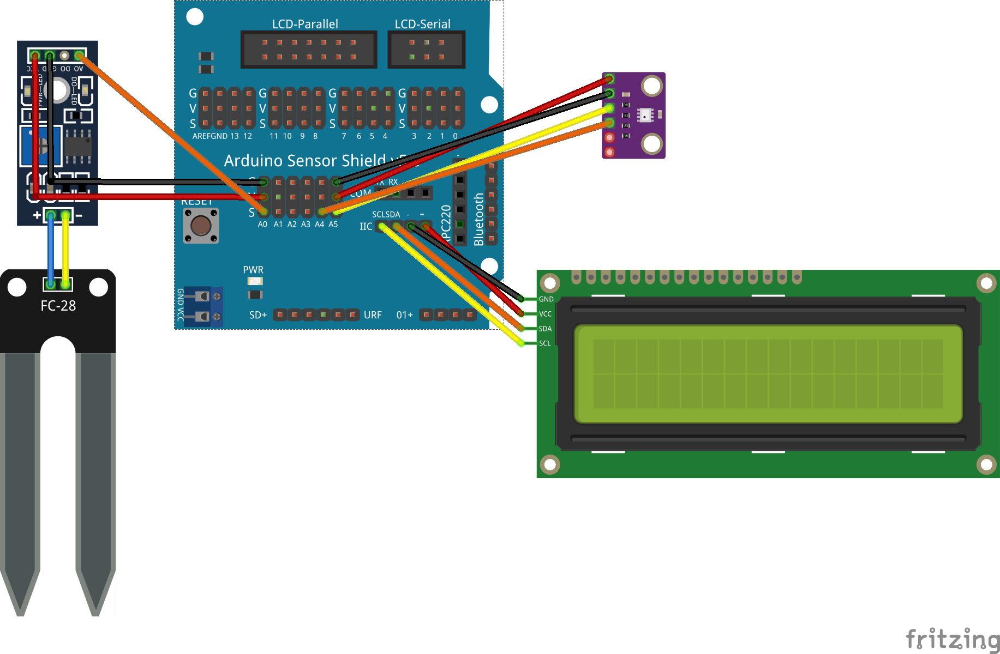
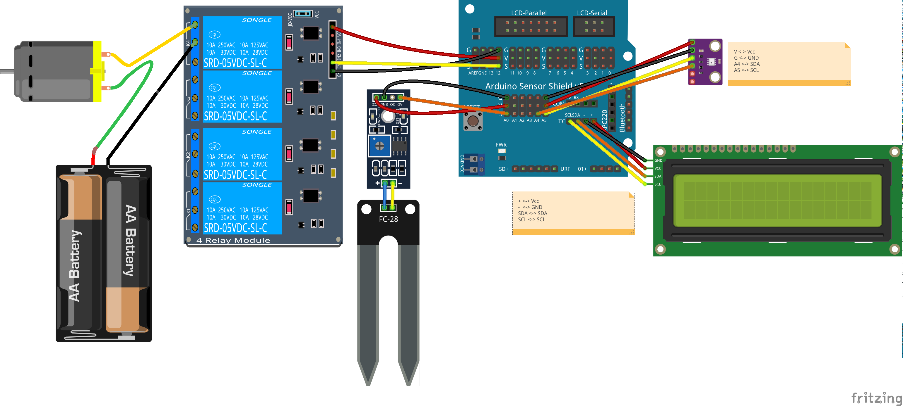
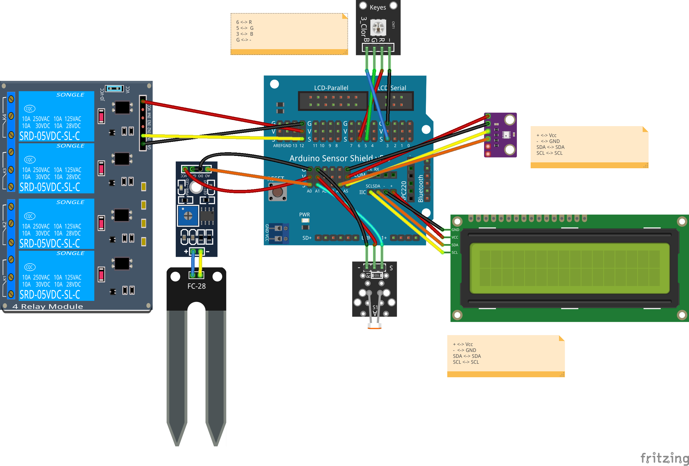

# Taller Práctico de Tecnología en las SmartCities

## [Red Guadalinfo](http://www.guadalinfo.es/)

### [Consorcio Fernando de los ríos](http://www.consorciofernandodelosrios.es/)

#### José Antonio Vacas Martínez

#### @javacasm

*****
# Proyecto domótica

## Información y control del hogar

Trabajaremos en implementar una casa domótica conectada con los siguientes elementos
  * Medida de la temperatura y humedad interna
  * Control y regulación de temperatura y humedad
  * Control de riego
  * Control de iluminación

Toda la información así como el control está disponible desde Internet

### Materiales
* Controlador
* Sensores (cualquiera entre:luz,temperatura, humedad,...)
* Wifi
* Placa de reles
* Alimentación
* Cables

## Montaje

## https://goo.gl/Yf3hrm

## Hello Led y PC

Conectamos un led a la patilla 13 y lo encendemos y apagamos, es el "Hola Mundo" de Arduino!! Podemos ver los desde el monitor serie: Menu Herramientas/Monitor Serie

Detalles:
* Pines de Arduino
* Polaridad LED
* Necesidad de resistencia

Sobre Arduino:
* Una vez programado, se puede desconectar y el programa se guarda.
* Al alimentarlo se ejecuta el último programa que se envió
* Sólo puede tener un programa, cuando se reprograma se pierde el anterior

### Ejemplo: [Domotica/1.LED_Conexion_PC](https://github.com/javacasm/SmartCities_Library/blob/master/examples/Domotica/_1.LED_Conexion_PC/_1.LED_Conexion_PC.ino)

## LCD

Conectamos una pantalla LCD y aprendemos a mostrar contenidos

Detalles:
* Pines Shield
* I2C
* Cada fabricante usa una dirección para su LCD.
* Podemos usar las direcciones:
    * 0x27
    * 0x3F

### Ejemplo: [Domotica/2.LCD](https://github.com/javacasm/SmartCities_Library/blob/master/examples/Domotica/_2.LCD/_2.LCD.ino)

## [Otros sensores](https://github.com/javacasm/SmartCities_Comunes/blob/master/Componentes.md)

## Sensor BME280

Usamos el sensor atmosférico BME280 para medir temperatura, presión y humedad ambiente

### Ejemplo: [Domotica/3_Meteo_BME280](https://github.com/javacasm/SmartCities_Library/blob/master/examples/Domotica/_3_Sensor_Atmosferico_BME280/_3_Sensor_Atmosferico_BME280.ino)

## Wifi

Antes de continuar tenemos que aprender a utilizar el Wifi de Arduino

[Configuración Wifi](./wifi.md)

Nos permite:
* Servidor Web
* Control remoto

Accedemos desde un navegador

#### http://192.168.1.ID/arduino/webserver (Cambiamos ID por el número de placa)

### Ejemplo: [Domotica/4_Meteo_Wifi](https://github.com/javacasm/SmartCities_Library/blob/master/examples/Domotica/_4_Meteo_Wifi/_4_Meteo_Wifi.ino)

## Sensor de humedad

(Descripción del sensor y su uso, pruebas a hacer y tema del agua)

### Ejemplo: [Domotica/5_Sensor_Humedad](https://github.com/javacasm/SmartCities_Library/blob/master/examples/Domotica/_5_Sensor_Humedad/_5_Sensor_Humedad.ino)

## Reles de riego

(Explicación sobre los relés  y su uso)

### Ejemplo: [Domotica/6_Reles](https://github.com/javacasm/SmartCities_Library/blob/master/examples/Domotica/_6_Reles/_6_Reles.ino)

## Conexión de Bomba

(Explicación de la bomba y su uso. Alimentación y consumo)

## Iluminacion automática
  Medida de luminosidad
  Conexión de iluminación (simulación con un led RGB)

Usamos un sensor LDR para medir la cantidad de luz
Para la iluminación utilizamos un led RGB que conectamos a 3 pines PWM (podemos modular la potencia que emiten)

### Ejemplo: [Domotica/7_iluminacion_automatica](https://github.com/javacasm/SmartCities_Library/blob/master/examples/Domotica/_7_Iluminacion_automatica/_7_Iluminacion_automatica.ino)

Mejoras:
* Cambiar el color de la Iluminación

### [Selector de colores](https://www.w3schools.com/colors/colors_picker.asp)

## [Contenido Kit](https://github.com/javacasm/SmartCities_Comunes/blob/master/Kit.md)

## [Código de la librería](https://github.com/javacasm/SmartCities_Library/archive/SmartCities.zip)
